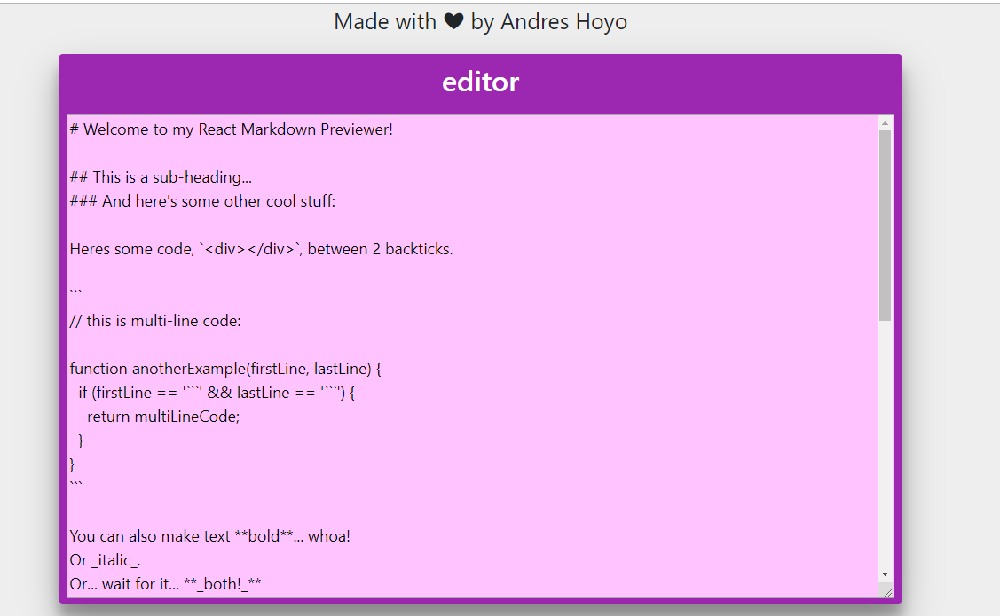
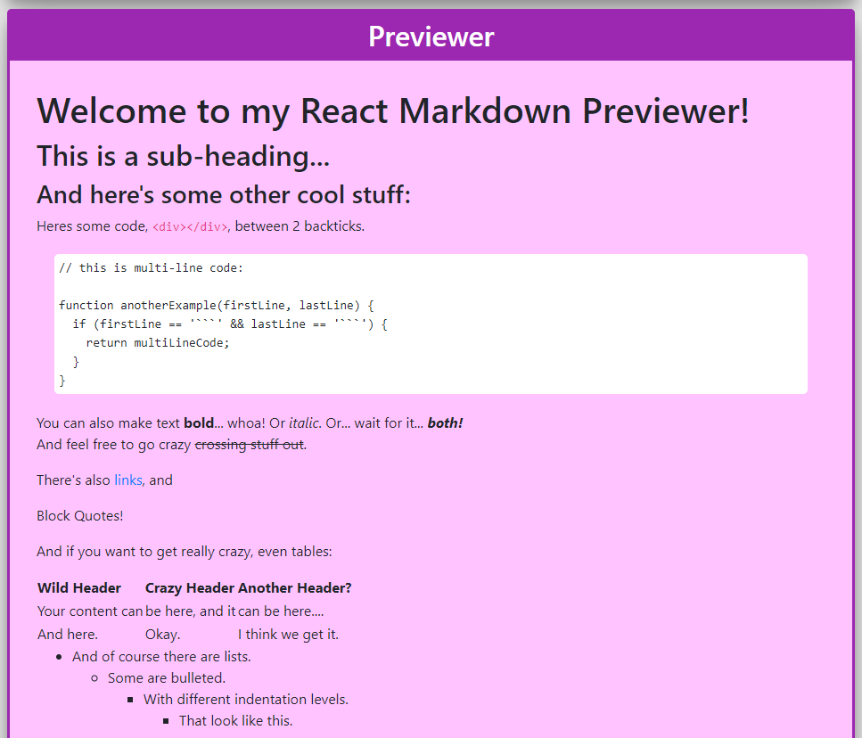
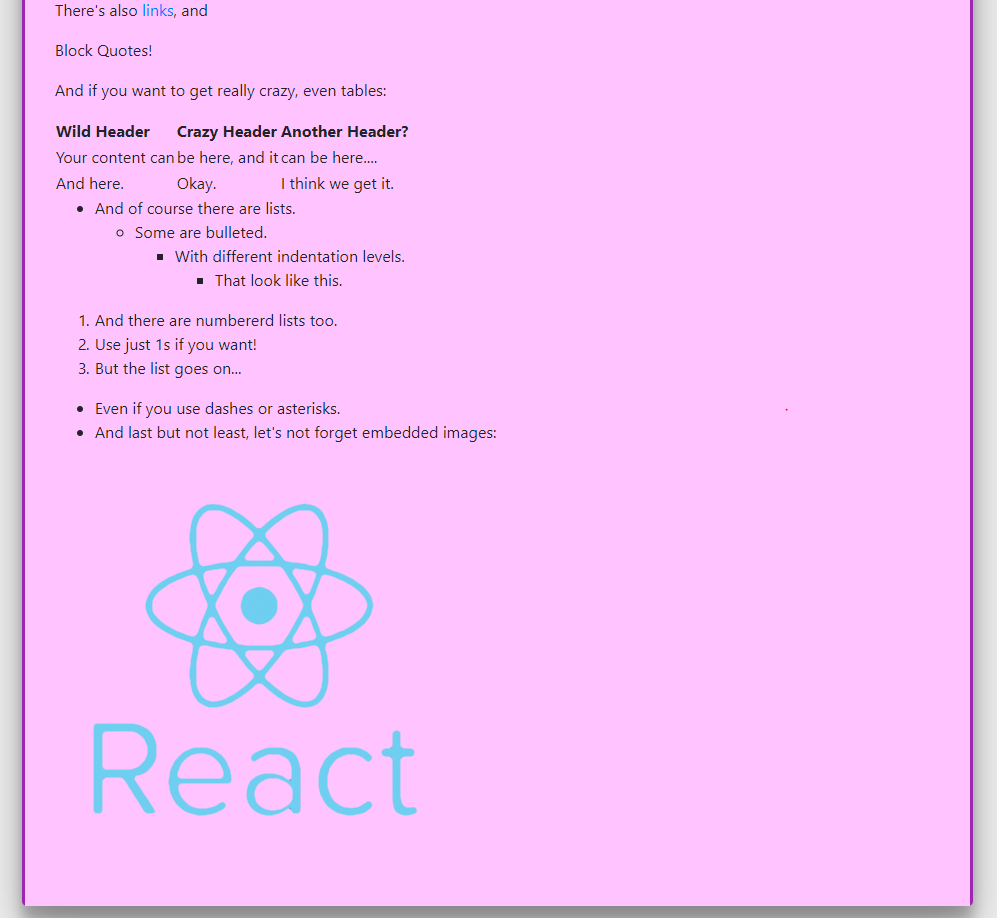

# Markdown previewer

## This is part of freecodecamp projects. 
    https://learn.freecodecamp.org/front-end-libraries/front-end-libraries-projects/build-a-markdown-previewer

## Technologies used
    -ReactJS

## Available Scripts

In the project directory, you can run:

### `npm start`

## Preview  
    images  

